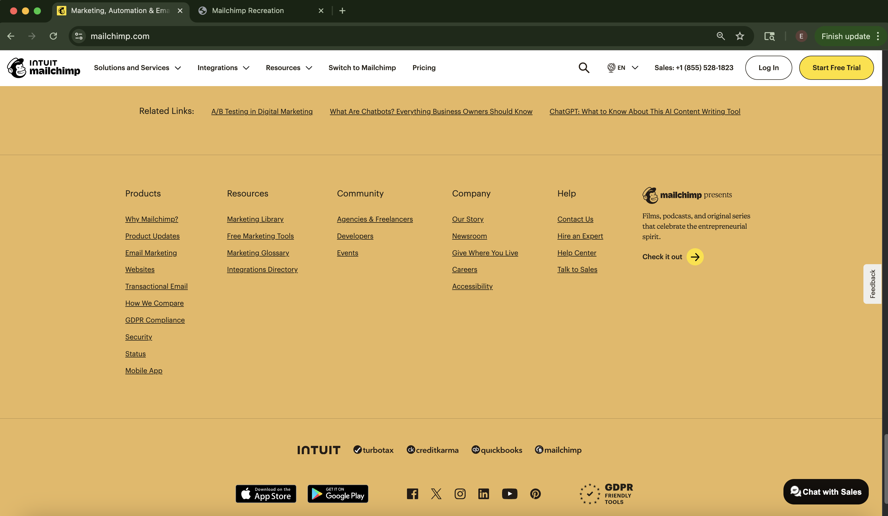

## The Importance of Frameworks in Web Development

UI frameworks are incredibly useful because they streamline the process of building web elements. Instead of writing long lines of CSS or JavaScript for each component, developers can simply use prebuilt classes that make their HTML cleaner and more readable. These frameworks act like toolkits, offering prebuilt templates and components that help developers build well-structured and visually appealing websites much more efficiently.

## The Challenge Without UI Frameworks

Without UI frameworks, you’re limited to just HTML and CSS. While both are powerful, building complex elements like responsive navigation bars requires creating everything from scratch. This can be especially time-consuming and frustrating when working on large-scale projects. From personal experience, I’ve faced several challenges when using only raw HTML and CSS, especially with layout and responsiveness. While it’s definitely possible to build everything manually, it becomes a hassle and slows down development.

## The Learning Curve of UI Frameworks

Despite their benefits, UI frameworks like Bootstrap can be difficult to learn at first. With so many classes, utilities, and components available, it can feel overwhelming trying to understand what each one does. For example, when creating a navbar in Bootstrap, there are multiple classes you can use to make it responsive and functional by using .navbar-expand-lg, .navbar-brand, .navbar-light, .dropdown-menu, etc. Each of these plays an important role in either the design or functionality of the navbar. One reason Bootstrap includes so many classes is to make webpages responsive across all screen and window sizes. Rather than writing custom media queries for each element, developers can rely on classes like .navbar-expand-lg, which automatically adjust layout based on screen width.

While remembering and combining all these classes can be complicated, the results make the time investment worthwhile. These classes allow for powerful customization without the need to write extra CSS or HTML. For instance, building a dropdown menu that works well on all devices could take dozens of lines from scratch, but with Bootstrap, it can be done in under 10 lines using the right class combinations.

## My Experience Recreating a Webpage

In my own experience using Bootstrap 5, I recreated a webpage from [Mailchimp's website](https://mailchimp.com/). The process was challenging, as there were many different sections and styles to replicate. Organizing the styling of the page to closely match the original required a significant amount of work to build and refine it. However, Bootstrap definitely made the process easier by providing classes to help with creating the navbar, styling buttons, and adding unique features like a 4-column section with images in the middle of the page. It was also helpful using this UI framework as it adjusted accordingly to the window size, whether it was small or large, resulting in a functional webpage.

  Original:

  
  
  

  Recreation:

  
  
  

## Conclusion
Overall, UI frameworks like Bootstrap are incredibly helpful tools that simplify and speed up web development. They may have a steep learning curve at first, but once you become familiar with the structure and available classes, building responsive and appealing websites becomes much more efficient. While it’s still important to understand HTML and CSS fundamentals, using a framework can save you time and help you produce cleaner, more maintainable code.

