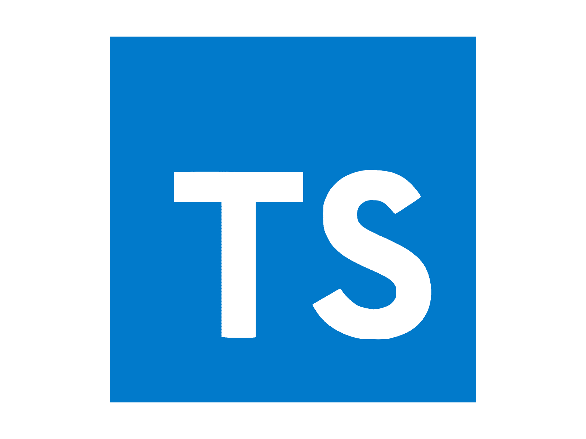

## My Coding Journey

  Java is the language that I’ve spent most of my coding journey with. Through understanding data structures and various algorithms, this language has become the foundation of my programming and my understanding of concepts in computer science. However, when I was introduced to Typescript in this module, my previous knowledge aided me in my journey of learning this new language, diving into a new but familiar territory. My coding background has helped me tremendously in understanding TypeScript’s syntax and structure quickly.

## Java and JavaScript

  To learn TypeScript, I had to become more familiar with JavaScript. As I completed the tutorial, the similarities between JavaScript and Java can be clearly seen from their syntax, loops, if statements, and many other aspects, which ultimately helped me transition into this new language smoothly. However, the difference that I noticed was its very laid-back treatment of variable types. Java uses strict data types like int and boolean, which are also used in JavaScript, but are instead assigned automatically depending on the value of the variable. Additionally, JavaScript variables can use the keyword “let” to allow the variable to be reassigned and “const” to prevent that action. Another difference is their syntax for creating functions, specifically arrow functions, which are meant to write functions in a shorter form, which is very useful for short/one-liner functions.

## Transitioning to TypeScript
  After getting familiar with JavaScript, this next step in learning Typescript helped me understand why it was created. Personally, Typescript felt like the remastered version of JavaScript as it addresses the limitations of the original language. For instance, JavaScript’s use of guessing the data type creates the possibility of creating minor errors for unique cases. To prevent this, TypeScript allows us to declare what data type the variable is. This improves development and lessens runtime failures, contributing greatly to my practice and in-class WODs.

  

## Athletic Software Engineering/WODs

  The concept of athletic software engineering and assigning WODs is very crucial to my learning process, as it forces me to showcase what I’ve learned from the unit. The practice WODs were really helpful in my understanding of Typescript, pushing me to apply the concepts learned and to familiarize myself with its syntax. The practice and real WODs have been stressful to do, but have been rewarding. The process of being under a time limit helped me focus on the problem, and completing the problem successfully gives me confidence in using these skills.		

## Conclusion

  Learning Typescript has not only expanded my knowledge in computer languages, but has also deepened my understanding of how different programming languages can be better than others in declaring data types and easier/shorter syntax. Utilizing my prior experience in programming has made me more adaptable in learning different languages. The WODs, while challenging, simulate practice under pressure, which is a very effective way to test my knowledge in applying the concepts that I have learned throughout this module.
