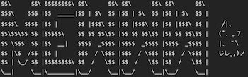

In my senior year, I worked collaboratively with two other classmates to design and develop a secure password manager to obtain my CTE Honors. The goal was to create a program that could generate strong randomized passwords, using a mix of uppercase and lowercase letters, numbers, and symbols.

Our application also included an account creation system that allowed users to store their passwords for variuous accounts they have. Each user account requires a unique username, password, and a secuirty question/answer to ensure security of the passwords and the identity verification process.

This project helped me with my understanding of cybersecuirty principles, user authentication, and securely handle data. I contributed to the development of the password generation algorithm and the user authentication logic.

Source: <a href="https://github.com/jogarces/ics-313-text-game"><i class="large github icon "></i>jogarces/ics-313-text-game</a>
